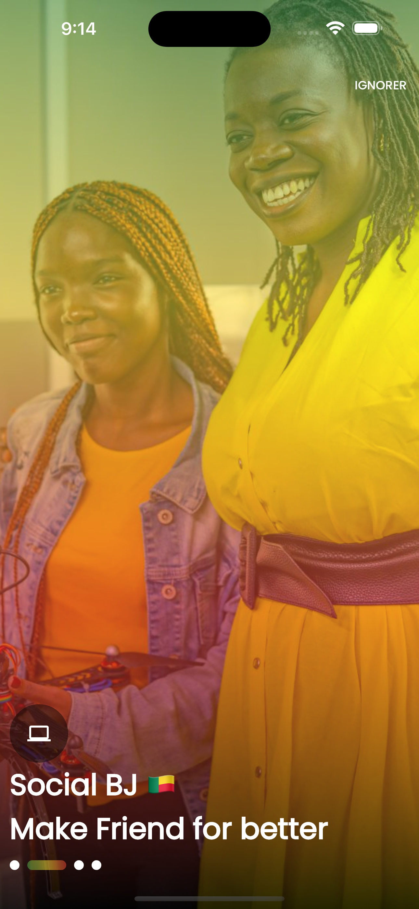
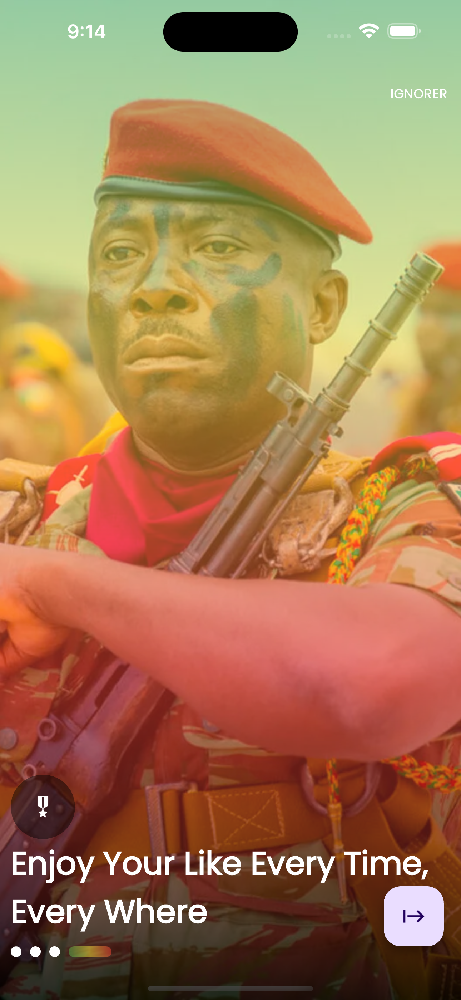
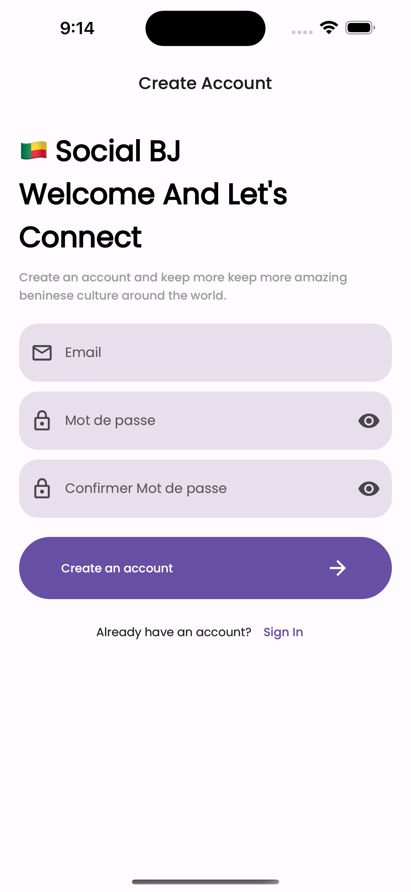
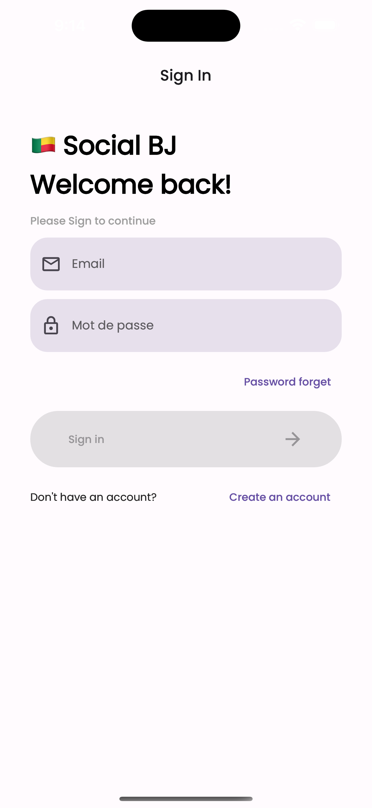
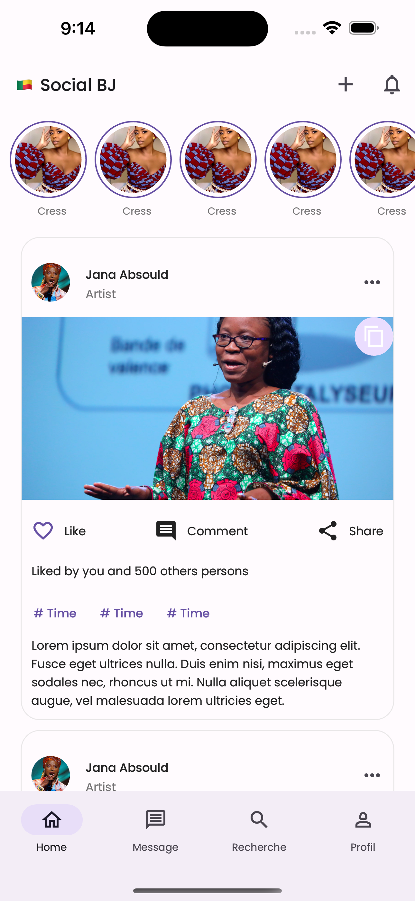
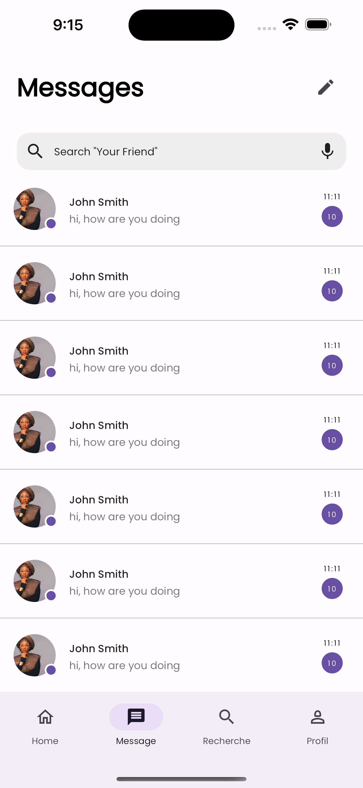
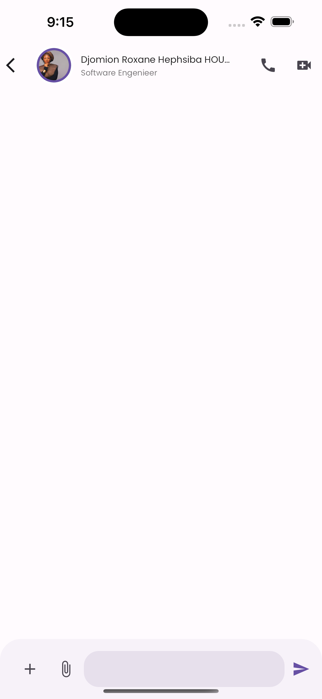
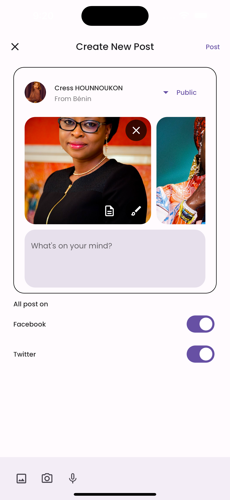

# Social BJ App - Flutter Project


## Table of Contents
- [Introduction](#introduction)
- [Features](#features)
- [Technologies Used](#technologies-used)
- [Getting Started](#getting-started)
- [How to Use](#how-to-use)
- [Contributing](#contributing)
- [License](#license)
- [Contact](#contact)
## Screeshots



<br>



<br>



<br>



## Introduction

Welcome to the Social BJ App repository! This is a Flutter-based social media application specifically designed for the people of Benin (Beninese). The app aims to create a community-driven platform where users can connect, share content, and interact with each other in a culturally relevant and user-friendly environment.

## Features

- **User Registration and Authentication**: Users can sign up, create accounts, and log in securely.
- **Multilingual Support**: The app supports multiple languages, including French, Fon, and Yoruba, to cater to a diverse user base.
- **Feed and Posts**: Users can create posts, share updates, and view a dynamic feed of content from other users.
- **User Profiles**: Each user has a personalized profile that showcases their information and activities.
- **Commenting and Liking**: Users can engage with posts by commenting and liking them.
- **Real-time Notifications**: Users receive notifications for new interactions and updates.
- **Privacy and Security**: The app prioritizes user privacy and implements robust security measures.
- **Local Content**: The platform encourages users to share local news, events, and topics of interest.
- **Responsive Design**: The app is optimized for mobile devices, ensuring a smooth user experience.

## Technologies Used

- Flutter
- Dart
- Firebase (Authentication, Firestore, Cloud Functions)


## Getting Started

To get started with the Social BJ App, follow these steps:

1. Clone this repository to your local machine using:
   ```
   git clone https://github.com/your-username/social-bj-app.git
   ```

2. Install Flutter and set up your development environment. For instructions, visit the official [Flutter documentation](https://flutter.dev/docs/get-started/install).

3. Ensure you have all the necessary dependencies installed by running:
   ```
   flutter pub get
   ```

4. Connect the app to Firebase by following the configuration steps for Firebase Authentication and Firestore.

5. Run the app on your preferred device or emulator using:
   ```
   flutter run
   ```


## Contributing

We welcome contributions to enhance the Social BJ App. To contribute, follow these steps:

1. Fork this repository to your GitHub account.

2. Create a new branch from the `main` branch with a descriptive name:
   ```
   git checkout -b feature/your-feature-name
   ```

3. Make your changes, add new features, or fix bugs.


4. Commit your changes and push them to your forked repository.

4. Create a pull request to merge your changes into the main repository.

We appreciate your help in making Social BJ App even better!


## Contact

If you have any questions, suggestions, or feedback, feel free to contact the project maintainer:

- Name: Georges Cress HOUNNOUKON
- Email: cresshounnoukon@gmail.com
- Phone: +229 67010140